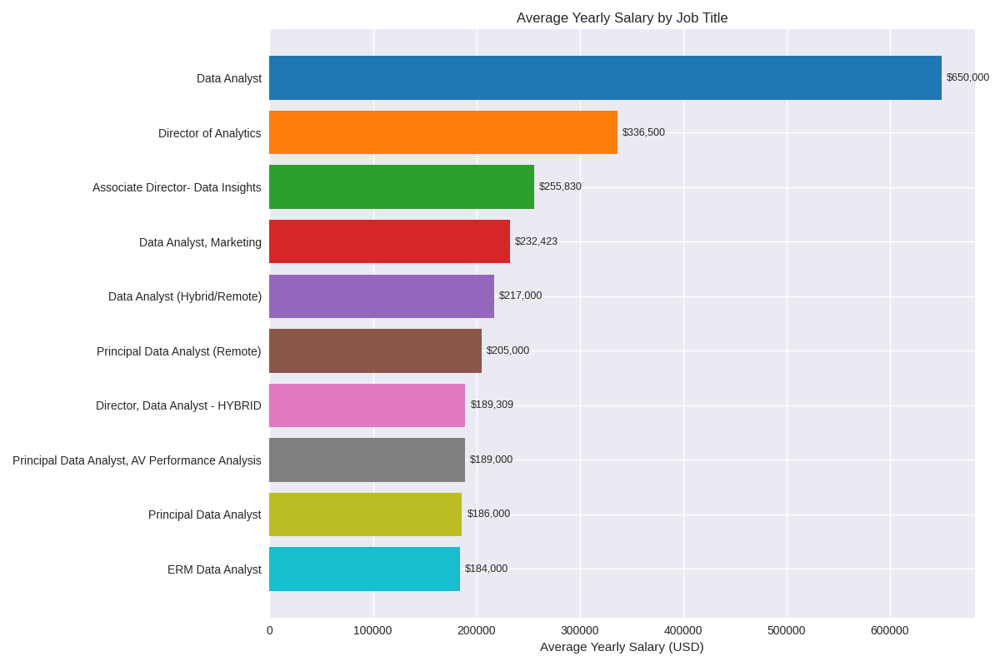
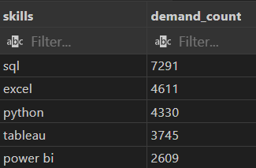
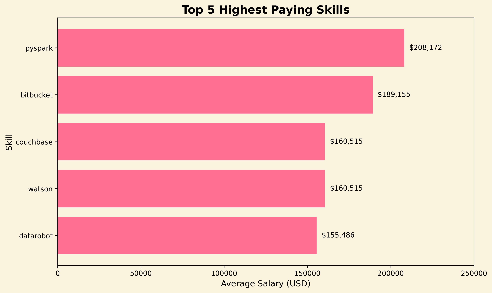

# Data Analyst Job Market Analysis (SQL)
A SQL‑based exploration of remote Data Analyst job postings to uncover top‑paying roles, the most in‑demand skills, and the technical abilities linked to higher salaries.

# Project Summary
This project analyzes a dataset of remote Data Analyst job postings using SQL.
The goal is to understand the current job market by identifying:

* Which roles offer the highest salaries

* Which skills employers request most often

* Which skills are associated with higher pay

* How skill demand aligns with compensation

All analysis is done directly in SQL using CTEs, joins, aggregations, subqueries, and window functions.

# Tools & Skills Used
SQL: CTEs, JOINs, aggregations, window functions, subqueries
Database: PostgreSQL
Analysis: Data cleaning, exploratory analysis, job‑market insights, salary–skill correlation

# Analysis

## 1. Top 10 highest‑paid remote Data Analyst positions

This section highlights the top‑earning remote Data Analyst positions in 2023. Salaries range from $184K up to an impressive $650K, with companies like Mantys, Meta, and AT&T leading the list. All roles are fully remote and span analyst, senior, and director‑level positions.



## 2. Skills for Top‑Paying Data Analyst Roles

High‑paying roles consistently rely on strong analytical foundations—SQL, Python, and R.
Cloud, big‑data, and BI tools such as AWS, Azure, Snowflake, Databricks, Tableau, Power BI, and Excel also appear frequently.
Senior roles often require additional engineering and workflow tools like GitLab, Jira, Confluence, and Bitbucket.


## 3.Top 5 Most In‑Demand Skills for Data Analysts
```sql
SELECT skills,
    count(skills_job_dim.job_id) as demand_count
from job_postings_fact
    INNER JOIN skills_job_dim on job_postings_fact.job_id = skills_job_dim.job_id
    INNER JOIN skills_dim on skills_job_dim.skill_id = skills_dim.skill_id
WHERE job_title_short = 'Data Analyst'
    and job_work_from_home = TRUE
GROUP BY skills
ORDER BY demand_count DESC
limit 5;
```
### Output chart:



Easily can see that-

* SQL is by far the most requested skill, appearing in more than 7,000 postings.

* Excel and Python remain essential core tools.

* Tableau and Power BI show strong demand for visualization and dashboarding.

## 4.Top 5 Most In‑Demand Skills for Data Analysts



* Highlights strong salaries for engineering‑heavy and AI/ML tools.

* Shows the top 5 highest‑paying skills, led by PySpark and Bitbucket.

* Focuses on the top five to keep the insights clear and easy to compare.

## 5.Demand vs. Salary: Which Skills Offer the Best Balance?

.png)

* Shows how each skill ranks in demand vs. salary, revealing which tools offer the best balance of market need and earning potential.

* Python, Tableau, and R lead in demand, while Databricks and cloud tools deliver the highest salaries.

* Helps identify skills that are both high‑value and widely required in data roles.

# Conclusion
This analysis shows that remote Data Analyst roles reward a strong mix of core analytical skills (SQL, Python, Excel) and modern data‑engineering tools like Snowflake, Databricks, and AWS. High‑demand skills such as Python, Tableau, and R remain essential across the market, while specialized tools—especially Databricks—offer notable salary advantages.

Overall, combining high‑demand fundamentals with high‑value technical skills is the clearest path to stronger job prospects and higher‑paying opportunities in the data field. 